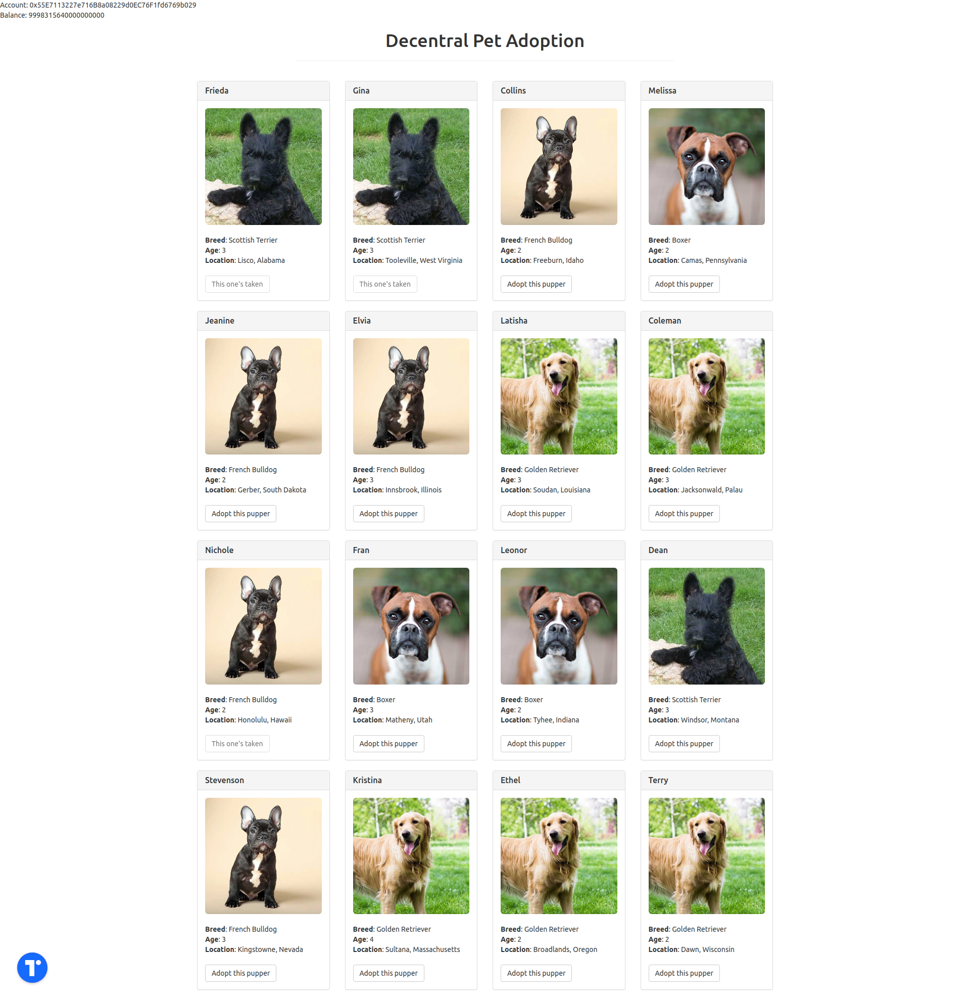

## Decentralized Pet Adoption

Adopt a cute pupper with this toy dapp hosted with local ganache blockchain.

# Prerequisites

1. An ethereum blockchain running on localhost:8546 ()
2. truffle to compile and migrate contracts (`npm install -g truffle`)
3. serve to serve the file (`npm install -g serve`)
4. Metamask connected to the blockchain in 1.
5. ganache-http-proxy (`npm install -g ganache-http-proxy`) see https://docs.tor.us/developers/getting-started-with-ganache

# Steps to host this app

1. Clone this repo
2. `cd` to repo root
3. Make sure an eth blockchain is running on localhost:8546
3. `truffle compile`
4. `truffle migrate`
5. `truffle test` (to make things are setup correctly)
6. `serve -s build`

# Step to use this app

1. Open localhost:5000 in a browser with metamask installed and connected to localhost:8546.
2. Oauth login with torus.
3. You will see an address at the top with balance = 0.
4. Try adopting a pet. You can't because there is no eth for gas.
5. Copy this address from the text or use torus button to copy the address.
6. Transfer some eth to this address.
7. Click on any 'Adopt this pupper'.
8. Approve the gas transaction.